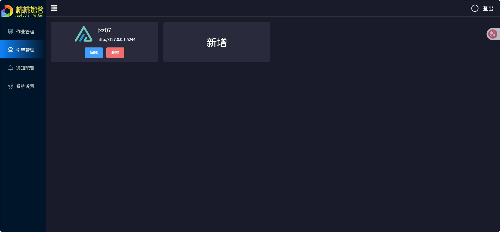
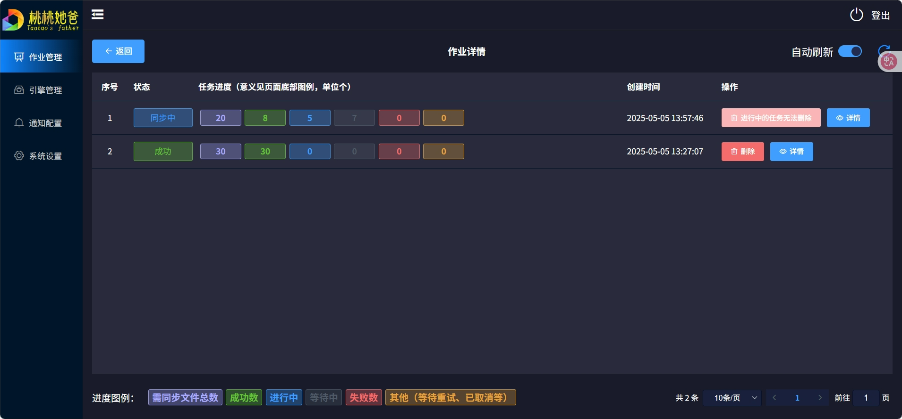
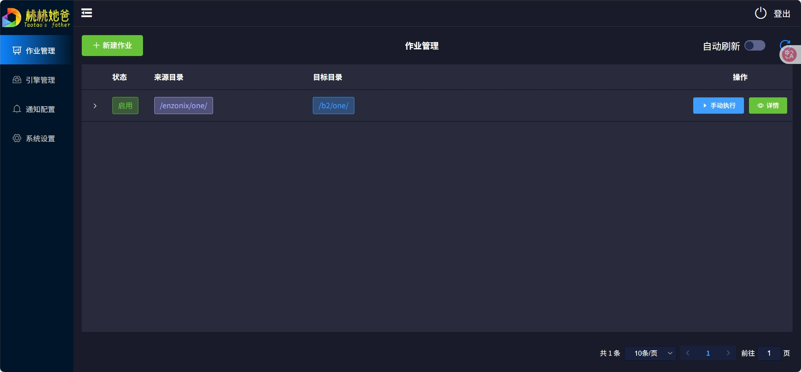

### summary
alist is a popular open source tool which can help you control your many network disk.And taoSync is a tool help you to copy the data between different network disk. Now let us learn how to run the taoSync
### github link
taoSync [https://github.com/dr34m-cn/taosync](https://github.com/dr34m-cn/taosync)
alist [https://github.com/AlistGo/alist](https://github.com/AlistGo/alist)
### installation
taoSync is written in python.And it has a web frontend.We need to compile the frontent.I help you to compile it.The below is the file link. [taosync-v0.2.7.tar.gz](taosync-v0.2.7.tar.gz)  
```bash
cd <the folder you want put the app>
tar xf taosync-v0.2.7.tar.gz
pip install -r requirements.txt
python main.py
```
You need to change the password firstly.
### enter the web panel
The app is defaultly open on the private network.If you are running it on a remote server,you can't visit the web panel.You can use the ssh tunnel.And the app taoSync should not be open on the public network.
```bash
ssh -L 127.0.0.1:8023:127.0.0.1:8023 <user>@<address>
```
### other
There are releases on the github.Why not we use the official release?The app is written in python.And the author use the tool pyinstaller.And I found when I tried to run on debian 12,it didn't work very well.It showed that I lacked the lib musl.But musl should be used in alpine.So I choose to run it with python.
### compile yourself
What we need to compile is the frontend.It need the nodejs.
```bash
cd <the folder you want to put the file>
git clone https://github.com/dr34m-cn/taosync.git
cd taosync/frontend
npm i
npm run build
```
You should put the files in the folder `taosync/frontend/dist` to the folder `front` near the file `main.py`
### file tree
```tree
.
├── common
│   ├── commonService.py
│   ├── commonUtils.py
│   ├── config.py
│   ├── __init__.py
│   ├── LNG.py
│   ├── __pycache__
│   ├── sqlBase.py
│   └── sqlInit.py
├── controller
│   ├── baseController.py
│   ├── __init__.py
│   ├── jobController.py
│   ├── notifyController.py
│   ├── __pycache__
│   └── systemController.py
├── front
│   ├── alist.svg
│   ├── css
│   ├── fonts
│   ├── img
│   ├── index.html
│   ├── js
│   ├── logo-128-128.png
│   ├── logo-200-64.png
│   ├── notify
│   └── robot.txt
├── main.py
├── mapper
│   ├── alistMapper.py
│   ├── __init__.py
│   ├── jobMapper.py
│   ├── notifyMapper.py
│   ├── __pycache__
│   └── userMapper.py
├── requirements.txt
└── service
    ├── alist
    ├── __init__.py
    ├── notify
    ├── __pycache__
    ├── syncJob
    └── system
```
### screenshot


